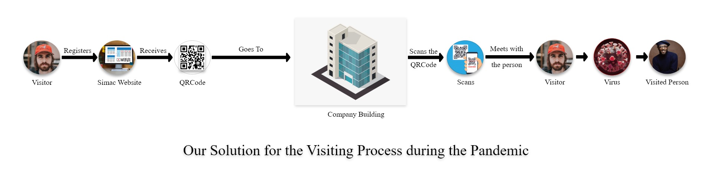
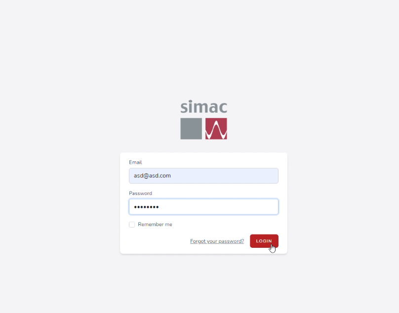
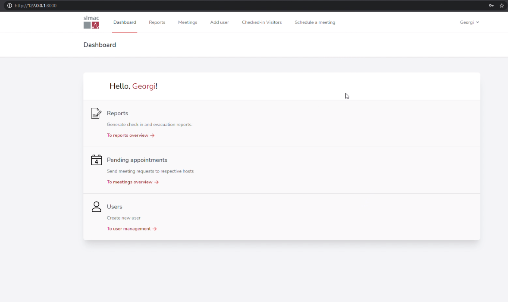
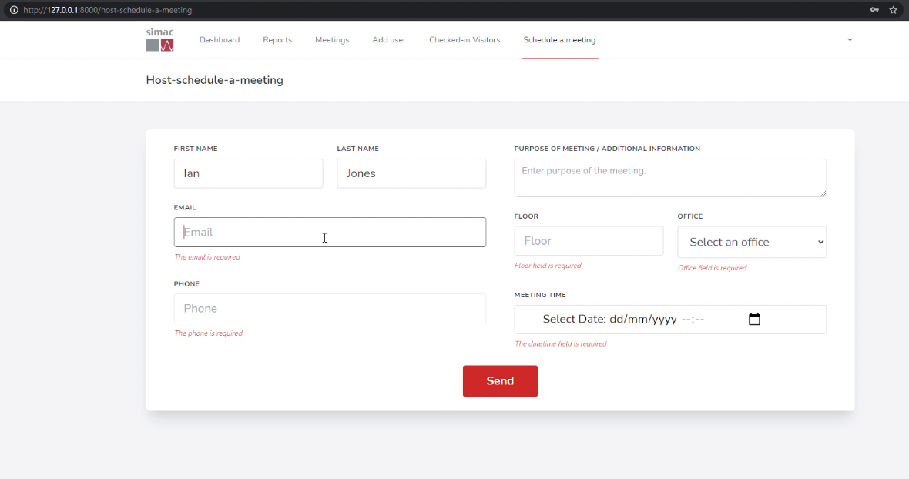
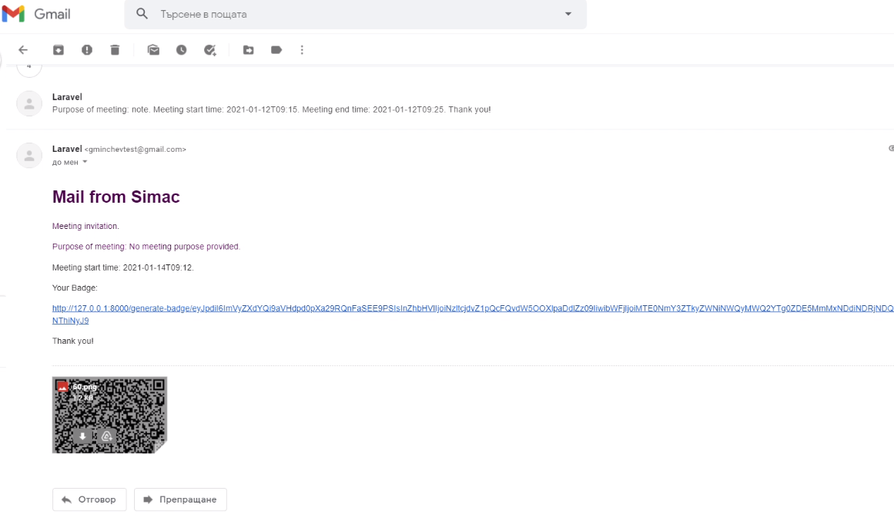
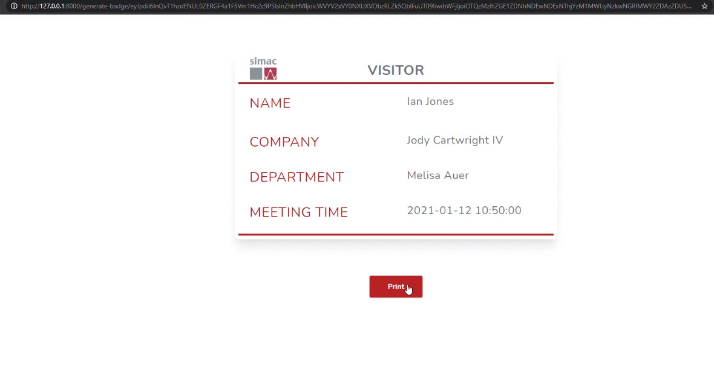

# Simac

This repository contains the semester 3 group project built for the Simac company. It is built on top of Laravel 8 and uses Vue.js 2 and Tailwind CSS for the front-end.

The idea behind Simac visitor management is to digitalise the paper logbook within client companies’ receptions and solve all the tasks related. With the help of this software solution all visitor management related operations will be performed in a more efficient way saving time and money to the companies.

<table align="center"><tr><td align="center" width="9999">
<a align="center">
 

  

  

  

  

  

</a>
</td></tr></table>
